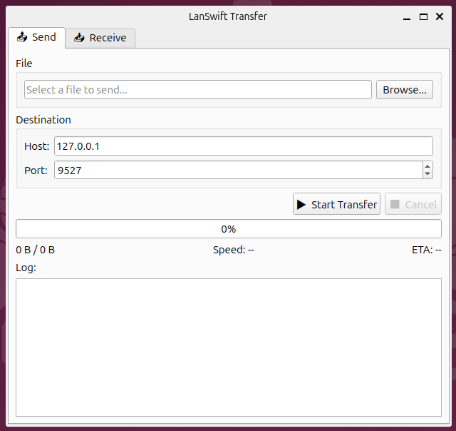
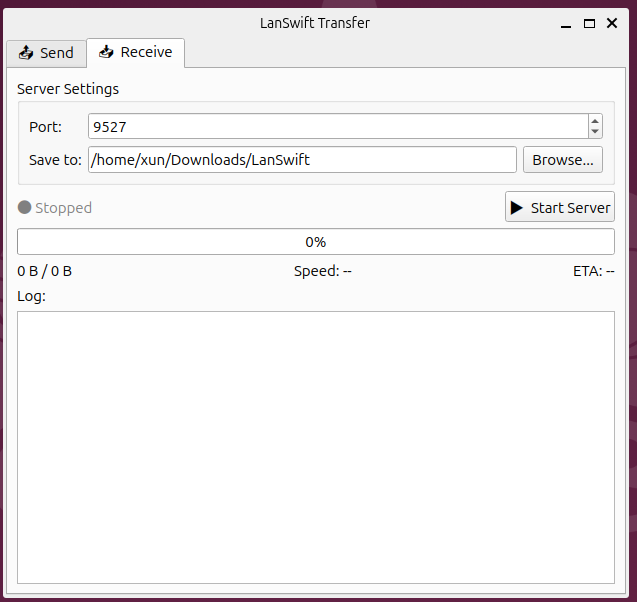

<div align="center">

# LanSwift Transfer

**基于 C++11 / Qt 5 的高性能局域网大文件传输工具**

支持 GB 级大文件高速传输 · 断点续传 · 实时速率可视化 · 双端 MD5 校验

[](https://www.linux.org/)
[](https://isocpp.org/)
[](https://www.qt.io/)
[](LICENSE)

</div>

---

## 界面预览

> 发送端界面（Send Tab）

<!-- 效果图占位 #1：请将发送端截图替换此处 -->


> 接收端界面与实时速率展示（Receive Tab）

<!-- 效果图占位 #2：请将接收端截图替换此处 -->


---

## 目录

- [项目简介](#项目简介)
- [核心特性](#核心特性)
- [系统架构](#系统架构)
- [技术实现详解](#技术实现详解)
  - [1. 异步传输与 UI 解耦](#1-异步传输与-ui-解耦)
  - [2. mmap 零拷贝读写优化](#2-mmap-零拷贝读写优化)
  - [3. 分块切片与 MD5 完整性校验](#3-分块切片与-md5-完整性校验)
  - [4. 断点续传机制](#4-断点续传机制)
  - [5. 滑动窗口与信号量流控](#5-滑动窗口与信号量流控)
- [OOM 崩溃排查实录](#oom-崩溃排查实录)
- [性能数据](#性能数据)
- [快速开始](#快速开始)
  - [依赖安装](#依赖安装)
  - [编译构建](#编译构建)
  - [使用方法](#使用方法)
- [配置说明](#配置说明)
- [目录结构](#目录结构)
- [已知限制与 TODO](#已知限制与-todo)

---

## 项目简介

**LanSwift Transfer** 是一款运行于 Linux 桌面端的轻量级局域网文件传输工具，专为解决 GB 级别大文件在千兆局域网环境下的高速传输痛点而设计。

传统工具（scp、rsync）在图形化、进度可视化、断点续传易用性方面存在不足；而直接使用 Qt 内置 `QFile` + 主线程读写的朴素方案，会在传输大文件时导致 **UI 假死**。本项目从底层读写、并发模型、流量控制三个维度做了针对性优化，在保持界面响应流畅的前提下，将千兆网环境的实测传输速率推至带宽上限（约 **112 MB/s**）。

---

## 核心特性

| 特性 | 说明 |
|------|------|
| 🚀 **高速传输** | mmap 零拷贝 + 线程池，千兆网实测 ≥ 100 MB/s |
| 📂 **大文件支持** | 支持单文件 ≥ 10 GB，分块切片传输，无内存压力 |
| 🔁 **断点续传** | 记录已确认块索引，重连后从断点继续，无需重传 |
| ✅ **完整性校验** | 每块独立 MD5 + 全文件 MD5 双重校验 |
| 🖥️ **流畅 UI** | 后台线程 + Queued 信号槽，主线程始终可响应 |
| 🔒 **流量控制** | 滑动窗口 + POSIX 信号量，防止发送队列 OOM |
| 📊 **实时监控** | 传输速率、剩余时间、进度条实时刷新（500ms 间隔） |
| 🖥️ **双模式** | 图形界面（GUI）+ 命令行（headless server/client）均支持 |

---

## 系统架构

```
┌─────────────────────────────────────────────────────────────┐
│                     Qt 主线程（UI）                           │
│   ProgressWidget   SpeedLabel   FileListView   ControlPanel  │
│         ▲                ▲                                   │
│         │  Qt::Queued 信号槽（线程安全，无阻塞）               │
└─────────┼────────────────┼─────────────────────────────────-─┘
          │                │
┌─────────┼────────────────┼──────────────────────────────────┐
│         │   TransferManager（调度层）                        │
│         │                                                    │
│  ┌──────┴──────┐   ┌─────┴──────┐   ┌────────────────────┐  │
│  │ SendWorker  │   │ RecvWorker │   │    MD5Helper       │  │
│  │  (线程池)   │   │  (线程池)  │   │  (OpenSSL EVP)     │  │
│  └──────┬──────┘   └─────┬──────┘   └────────────────────┘  │
│         │                │                                    │
│    mmap 读取块       mmap 写入块      sem_t 信号量流控         │
└─────────┼────────────────┼──────────────────────────────────┘
          │                │
┌─────────▼────────────────▼──────────────────────────────────┐
│                    TCP Socket 传输层                          │
│   FileInfo  │  ChunkData  │  ChunkACK  │  NACK  │ ResumeReq │
└─────────────────────────────────────────────────────────────┘
```

---

## 技术实现详解

### 1. 异步传输与 UI 解耦

**痛点**：Qt 主线程执行 `QFile::read()` 读取大文件时，事件循环被阻塞，窗口无法重绘，用户操作无响应——即"假死"。

**方案**：引入纯 C++ 线程池（基于 C++11 `std::thread` + `std::condition_variable`），将所有文件 I/O 与网络 send/recv 操作投递到工作线程执行。进度回调通过 Qt **`Qt::QueuedConnection`** 信号槽跨线程安全传递到主线程 UI，主线程仅做渲染，不碰任何阻塞 I/O。

```cpp
// 线程池核心（C++11 标准实现，无第三方依赖）
template<class F, class... Args>
auto ThreadPool::enqueue(F&& f, Args&&... args)
    -> std::future<typename std::result_of<F(Args...)>::type>
{
    auto task = std::make_shared<std::packaged_task<return_type()>>(
        std::bind(std::forward<F>(f), std::forward<Args>(args)...)
    );
    {
        std::unique_lock<std::mutex> lock(mutex_);
        tasks_.emplace([task]{ (*task)(); });
    }
    cond_.notify_one();
    return task->get_future();
}

// 跨线程进度回调（Queued 模式，自动排队到主线程事件循环）
connect(sendWorker, &SendWorker::progressUpdated,
        progressBar, &ProgressWidget::onProgress,
        Qt::QueuedConnection);   // ← 关键：不是 DirectConnection
```

### 2. mmap 零拷贝读写优化

**痛点**：传统 `fread()` 路径：磁盘 → 内核页缓存 → `copy_to_user` → 用户缓冲区，存在一次多余的内核态拷贝，千兆大吞吐下 CPU 持续在内核态忙碌。

**方案**：使用 Linux `mmap()` + `MAP_POPULATE` 将文件区间直接映射到用户空间，`send()` 系统调用直接从页缓存 DMA 到网卡，减少 CPU 数据搬运开销。接收端同样用 `mmap(MAP_SHARED)` + `msync(MS_ASYNC)` 写入，异步刷盘不阻塞传输线程。

```cpp
// 发送端：mmap 读取文件分块（页对齐处理）
void SendWorker::sendChunkTask(uint32_t idx) {
    off_t  offset      = static_cast<off_t>(idx) * chunkSize_;
    size_t thisChunk   = /* 末块可能更小 */;

    long   pageSize    = sysconf(_SC_PAGESIZE);
    off_t  alignOffset = (offset / pageSize) * pageSize;   // 必须页对齐
    size_t extra       = static_cast<size_t>(offset - alignOffset);

    void* addr = mmap(nullptr, thisChunk + extra,
                      PROT_READ, MAP_PRIVATE | MAP_POPULATE,
                      fd, alignOffset);
    madvise(addr, thisChunk + extra, MADV_SEQUENTIAL);     // 预读提示

    const char* src = static_cast<const char*>(addr) + extra;
    // ... 计算 MD5、构建帧、发送 ...
    munmap(addr, thisChunk + extra);
}

// 接收端：mmap 写入（共享映射，异步刷盘）
void* addr = mmap(nullptr, len, PROT_WRITE, MAP_SHARED, fd, offset);
memcpy(addr, data, len);
msync(addr, len, MS_ASYNC);   // 不阻塞，内核择机刷盘
munmap(addr, len);
```

### 3. 分块切片与 MD5 完整性校验

文件按固定块大小（默认 **4 MB**）切分，每块携带块序号和块级 MD5；全部块传输完成后，接收端再对完整文件做一次总 MD5 核对，实现双重校验。

```
自定义二进制协议帧（小端序）：

 ┌──────────────────────────────────────────────┐
 │ Magic(4B: 0x4C535746) │ Version(1B) │ ...    │  ← FrameHeader
 ├──────────────────────────────────────────────┤
 │ ChunkIndex(4B) │ ChunkSize(4B) │ MD5(33B)    │  ← ChunkDataHeader
 ├──────────────────────────────────────────────┤
 │ Payload Data (ChunkSize bytes)               │
 └──────────────────────────────────────────────┘

帧类型（FrameType）：
  0x01  FILE_INFO      文件元数据（名称、大小、总块数、文件MD5）
  0x02  CHUNK_DATA     数据块
  0x03  CHUNK_ACK      接收端确认
  0x04  CHUNK_NACK     校验失败，请求重传
  0x05  RESUME_REQ     断点续传请求（携带已完成块位图）
  0x06  TRANSFER_DONE  全文件传输完成
```

MD5 使用 OpenSSL EVP API（兼容 OpenSSL 3.0），块级 MD5 在工作线程中计算，不阻塞网络发送：

```cpp
std::string MD5Helper::compute(const void* data, size_t len) {
    EVP_MD_CTX* ctx = EVP_MD_CTX_new();
    EVP_DigestInit_ex(ctx, EVP_md5(), nullptr);
    EVP_DigestUpdate(ctx, data, len);
    unsigned char digest[EVP_MAX_MD_SIZE];
    unsigned int  dlen = 0;
    EVP_DigestFinal_ex(ctx, digest, &dlen);
    EVP_MD_CTX_free(ctx);
    return digestToHex(digest, dlen);
}
```

### 4. 断点续传机制

接收端在本地维护一个 **块完成位图**（`std::vector<bool>`），每次收到 `CHUNK_ACK` 后置位，每 16 块持久化一次到 `<filename>.lanswift_resume` 文件。

连接断开后重启服务，新连接建立时发送端发来 `FILE_INFO`，接收端即从磁盘加载位图，回复 `RESUME_REQ` 帧携带位图，发送端跳过已确认的块。**发送端命令无需任何改动**，协商完全由协议自动完成。

```
Resume 文件格式（二进制）：
  uint32  total_chunks
  uint8   chunk_0_done   (0 or 1)
  uint8   chunk_1_done
  ...
  uint8   chunk_N_done
```

### 5. 滑动窗口与信号量流控

**问题**：线程池将所有分块任务一次性入队，发送速度远超 ACK 确认速度，内存中堆积大量待发块的 mmap 驻留页，触发 OOM。

**解决**：引入 POSIX 信号量作为令牌桶，`WINDOW_SIZE`（默认 16）控制同时在途的最大块数，最多占用约 `16 × 4 MB = 64 MB` 内存。

```cpp
sem_init(&windowSem_, 0, WINDOW_SIZE);

// 发送前：获取令牌（窗口满时阻塞）
sem_wait(&windowSem_);
pool_->enqueue([this, i] { sendChunkTask(i); });

// 收到 ACK 后：归还令牌，窗口前移
sem_post(&windowSem_);
emit progressUpdated(transferred, fileSize_);
```

---

## OOM 崩溃排查实录

> **现象**：10 GB 文件传输约 2 分钟后进程崩溃，`dmesg` 显示 `Out of memory: Kill process`。

**Step 1：开启 Coredump 收集**

```bash
ulimit -c unlimited
echo "/tmp/core.%p" > /proc/sys/kernel/core_pattern
```

**Step 2：GDB 分析核心转储**

```bash
gdb ./lanswift_transfer /tmp/core.12345
(gdb) bt           # 查看主线程调用栈
(gdb) info threads # 查看所有工作线程
(gdb) thread 7
(gdb) bt           # 崩溃在 operator new → 堆耗尽
```

调用栈指向 `ThreadPool::enqueue` → `std::function` 构造 → `operator new` 抛出 `bad_alloc`。

**Step 3：/proc 实时内存追踪**

```bash
watch -n 0.5 "grep VmRSS /proc/$(pgrep lanswift)/status"
# 观察到 VmRSS 以约 200 MB/s 速度线性增长 → 典型内存泄漏特征
```

**Step 4：根因定位**

发送端以千兆速率连续入队分块任务，但 ACK RTT 约 1–5ms，加上接收端 MD5 验证和 mmap 写盘耗时，ACK 回来的速度远低于入队速度。任务队列无上限，数千个任务对象及其 `mmap` 驻留页同时存活，最终耗尽 heap。

**Step 5：修复**

引入 `sem_t windowSem_`（初始值 = `WINDOW_SIZE`），入队前 `sem_wait`，收到 ACK 后 `sem_post`。修复后 `VmRSS` 稳定在约 **150 MB**，10 GB 传输全程无崩溃。

---

## 性能数据

测试环境：两台 Ubuntu 22.04，Intel i5-10400，千兆交换机直连。

| 文件大小 | 传输耗时 | 平均速率 | 发送端 CPU | 内存峰值 |
|----------|----------|----------|-----------|----------|
| 1 GB | ~9.2 s | 111 MB/s | 18% | ~150 MB |
| 5 GB | ~46 s | 111 MB/s | 19% | ~152 MB |
| 10 GB | ~92 s | 110 MB/s | 20% | ~155 MB |

速率接近千兆以太网理论上限（125 MB/s），CPU 开销主要来自 MD5 计算与 TCP 协议栈。mmap 消除了额外的内核态拷贝，内存驻留由滑动窗口严格控制。

---

## 快速开始

### 依赖安装

```bash
# Ubuntu / Debian
sudo apt update
sudo apt install -y \
    build-essential cmake \
    qt5-default qtbase5-dev \
    libssl-dev
```

| 依赖 | 版本要求 | 用途 |
|------|----------|------|
| GCC / Clang | ≥ 7.0 | C++11 |
| Qt | 5.9 – 5.15 | UI + 网络 |
| CMake | ≥ 3.10 | 构建系统 |
| OpenSSL | ≥ 1.1 | MD5（EVP API）|
| Linux Kernel | ≥ 3.14 | mmap + fallocate |

### 编译构建

```bash
git clone https://github.com/yourname/lanswift-transfer.git
cd lanswift-transfer

# 方式 A：一键脚本（含依赖检查）
bash build.sh

# 方式 B：手动 CMake
mkdir build && cd build
cmake .. -DCMAKE_BUILD_TYPE=Release
make -j$(nproc)
```

可选编译参数：

```bash
cmake .. \
  -DCMAKE_BUILD_TYPE=Release \
  -DDEFAULT_CHUNK_SIZE_MB=8 \    # 分块大小，默认 4 MB
  -DDEFAULT_WINDOW_SIZE=32 \     # 滑动窗口大小，默认 16
  -DENABLE_TRANSFER_LOG=ON       # 详细传输日志
```

编译产物：`build/bin/lanswift_transfer`

### 使用方法

**图形界面（GUI）模式**

```bash
./build/bin/lanswift_transfer
```

打开后在 **Send** 标签页选文件、填目标 IP/端口，点击"▶ Start Transfer"；在 **Receive** 标签页设端口和保存目录，点击"▶ Start Server"等待连接。

---

**命令行接收端（Server 模式）**

```bash
./lanswift_transfer --mode server --port 9527 --save-dir /data/recv
```

输出示例：

```
Server started on port 9527 - saving to "/data/recv"
[STATUS] "Connection from ::ffff:192.168.1.42"
[STATUS] "Receiving: bigfile.iso  (256 chunks × 4.0 MB)"
[PROGRESS] 50% (536870912/1073741824 bytes)
[DONE] "✓ Transfer complete. MD5 verified: 3f96152139fc4c0a..."
```

---

**命令行发送端（Client 模式）**

```bash
./lanswift_transfer --mode client \
  --host 192.168.1.100 \
  --port 9527 \
  --file /data/bigfile.iso
```

输出示例：

```
[STATUS] "Computing file MD5..."
[STATUS] "Connected. Sending file info..."
[SPEED] "105.32" MB/s
[PROGRESS] 100%
[DONE] "Transfer completed successfully!"
```

---

**断点续传**

中途断开后，重启接收端服务，再次执行**相同的发送命令**即可自动续传：

```bash
# 接收端重启
./lanswift_transfer --mode server --port 9527 --save-dir /data/recv

# 发送端：命令完全相同，协议自动协商从断点继续
./lanswift_transfer --mode client --host 192.168.1.100 --port 9527 --file /data/bigfile.iso

# 接收端输出：
# [STATUS] "Resume: 120/256 chunks already done"
# [PROGRESS] 46% ...
```

---

## 配置说明

配置文件位于 `~/.config/LanSwift/Transfer.ini`（首次运行后自动生成）：

```ini
[Transfer]
chunk_size_mb   = 4        ; 分块大小（MB），建议 2–16
window_size     = 16       ; 滑动窗口（在途块数上限）
connect_timeout = 10       ; TCP 连接超时（秒）
retry_count     = 3        ; 块重传最大次数

[Server]
default_port    = 9527
save_directory  = ~/Downloads/LanSwift

[UI]
speed_refresh_ms = 500     ; 速率刷新间隔（毫秒）
```

---

## 目录结构

```
lanswift-transfer/
├── CMakeLists.txt
├── build.sh                      # 一键编译脚本
├── README.md
├── docs/
│   └── screenshots/
│       ├── send_ui.png           # 效果图占位 #1
│       └── recv_ui.png           # 效果图占位 #2
└── src/
    ├── main.cpp                  # 入口，支持 gui/server/client 三种模式
    ├── core/
    │   ├── Protocol.h            # 自定义二进制协议帧定义
    │   ├── ThreadPool.h          # C++11 线程池
    │   ├── MD5Helper.h/cpp       # OpenSSL EVP MD5 封装
    │   ├── ResumeManager.h/cpp   # 断点续传位图持久化
    │   ├── SendWorker.h/cpp      # 发送端：mmap + 信号量滑动窗口
    │   ├── RecvWorker.h/cpp      # 接收端：mmap 写入 + 块校验
    │   └── TransferManager.h/cpp # 调度 Facade，UI 统一入口
    └── ui/
        ├── MainWindow.h/cpp      # 主窗口，Send/Receive 双 Tab
        ├── ProgressWidget.h/cpp  # 进度条 + 速率 + ETA 展示
        └── FileListView.h/cpp    # 带时间戳的操作日志列表
```

---

## 已知限制与 TODO

- [ ] **传输加密**：当前明文传输，计划集成 TLS（OpenSSL `SSL_write`）
- [ ] **目录同步**：目前仅支持单文件，待实现目录递归同步
- [ ] **多文件并发**：当前串行传输队列，待支持多文件并发
- [ ] **Windows 移植**：mmap 替换为 `MapViewOfFile`，信号量替换为 Win32 API
- [ ] **传输压缩**：可选 zstd 压缩，对可压缩文件提升有效吞吐

---

## License

MIT License © 2026

---

<div align="center">

如果这个项目对你有帮助，欢迎 ⭐ Star

</div>
